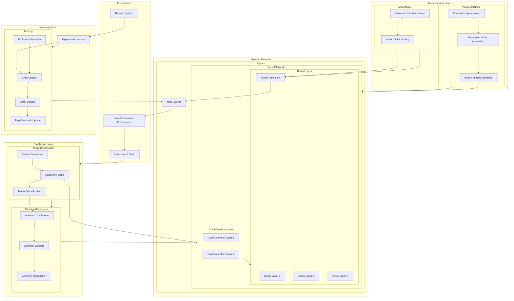

```mermaid
graph TD
    %% Environment Section
    subgraph Environment
        ENV[Crowd Evacuation Environment]
        ENV_STATE[Environment State]
        ENV_REWARD[Reward System]
    end

    %% Agent Architecture Section
    subgraph AgentArchitecture
        subgraph Agents
            MA[Multi-Agents]
            subgraph NeuralNetworks
                subgraph GraphAttentionLayers
                    GAT1[Graph Attention Layer 1]
                    GAT2[Graph Attention Layer 2]
                end
                subgraph DenseLayers
                    FC1[Dense Layer 1]
                    FC2[Dense Layer 2]
                    FC3[Dense Layer 3]
                    AP[Action Prediction]
                end
            end
        end
    end

    %% Graph Processing Section
    subgraph GraphProcessing
        subgraph GraphConstruction
            AM[Adjacency Matrix]
            RC[Radius Calculation]
            NORM[Matrix Normalization]
        end
        
        subgraph AttentionMechanism
            ATT_C[Attention Coefficients]
            ATT_W[Attention Weights]
            ATT_AGG[Attention Aggregation]
        end
    end

    %% Noise Enhancement Section
    subgraph NoiseEnhancement
        subgraph ActionNoise
            OU[Ornstein-Uhlenbeck Noise]
            AN_SCALE[Action Noise Scaling]
        end
        
        subgraph ParameterNoise
            PN[Parameter Space Noise]
            PN_ADAPT[Parameter Noise Adaptation]
            PN_STD[Noise Standard Deviation]
        end
    end

    %% Learning Components Section
    subgraph LearningSystem
        MEM[Experience Memory]
        subgraph Training
            CRITIC[Critic Update]
            ACTOR[Actor Update]
            TD[TD Error Calculation]
            TN[Target Network Update]
        end
    end

    %% Connections
    ENV --> ENV_STATE
    ENV_STATE --> GraphConstruction
    
    AM --> GraphAttentionLayers
    GraphConstruction --> AttentionMechanism
    AttentionMechanism --> GraphAttentionLayers
    
    GraphAttentionLayers --> DenseLayers
    
    ActionNoise --> AP
    ParameterNoise --> NeuralNetworks
    
    AP --> MA
    MA --> ENV
    
    ENV_REWARD --> MEM
    MEM --> Training
    Training --> MA
    
    %% Graph Processing Details
    RC --> AM
    AM --> NORM
    NORM --> ATT_C
    ATT_C --> ATT_W
    ATT_W --> ATT_AGG

    %% Noise Processing
    OU --> AN_SCALE
    AN_SCALE --> AP
    PN --> PN_ADAPT
    PN_ADAPT --> PN_STD
    PN_STD --> NeuralNetworks

    %% Learning Flow
    MEM --> CRITIC
    CRITIC --> ACTOR
    ACTOR --> TN
    TD --> CRITIC
```