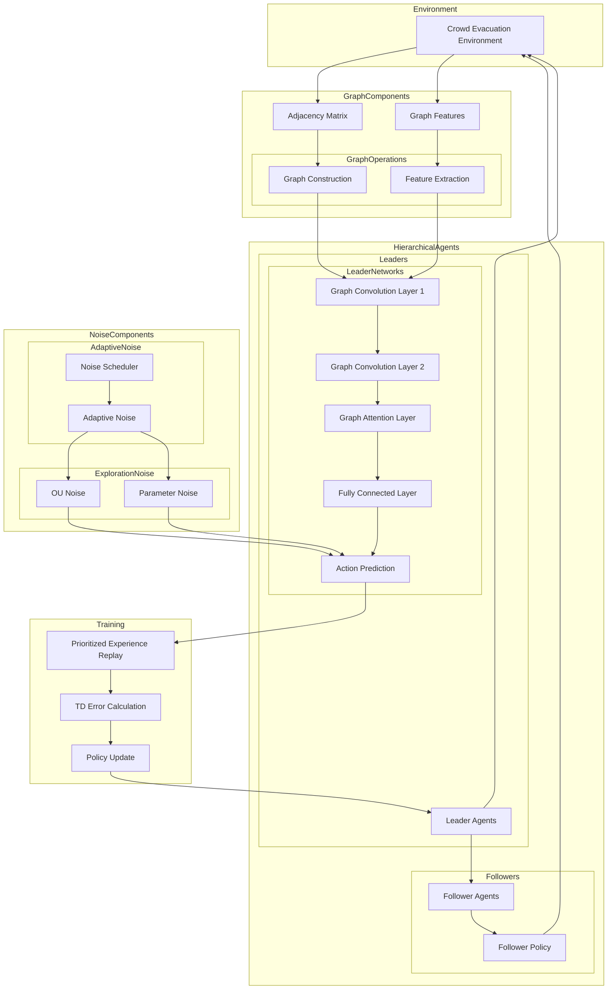

```mermaid
graph TD
    subgraph Environment
        ENV[Crowd Evacuation Environment]
    end

    subgraph HierarchicalAgents
        subgraph Leaders
            LA[Leader Agents]
            subgraph LeaderNetworks
                GCN1[Graph Convolution Layer 1]
                GCN2[Graph Convolution Layer 2]
                GAT[Graph Attention Layer]
                FC1[Fully Connected Layer]
                AP[Action Prediction]
            end
        end

        subgraph Followers
            FA[Follower Agents]
            FP[Follower Policy]
        end
    end

    subgraph NoiseComponents
        subgraph ExplorationNoise
            OU[OU Noise]
            PN[Parameter Noise]
        end
        
        subgraph AdaptiveNoise
            NS[Noise Scheduler]
            AN[Adaptive Noise]
        end
    end

    subgraph GraphComponents
        AM[Adjacency Matrix]
        GF[Graph Features]
        subgraph GraphOperations
            GC[Graph Construction]
            FE[Feature Extraction]
        end
    end

    subgraph Training
        PER[Prioritized Experience Replay]
        TD[TD Error Calculation]
        UP[Policy Update]
    end

    ENV --> AM
    ENV --> GF
    
    AM --> GC
    GF --> FE
    
    GC --> GCN1
    FE --> GCN1
    
    GCN1 --> GCN2
    GCN2 --> GAT
    GAT --> FC1
    FC1 --> AP
    
    OU --> AP
    PN --> AP
    
    NS --> AN
    AN --> OU
    AN --> PN
    
    AP --> PER
    PER --> TD
    TD --> UP
    UP --> LA
    
    LA --> FA
    FA --> FP
    
    LA --> ENV
    FP --> ENV
```