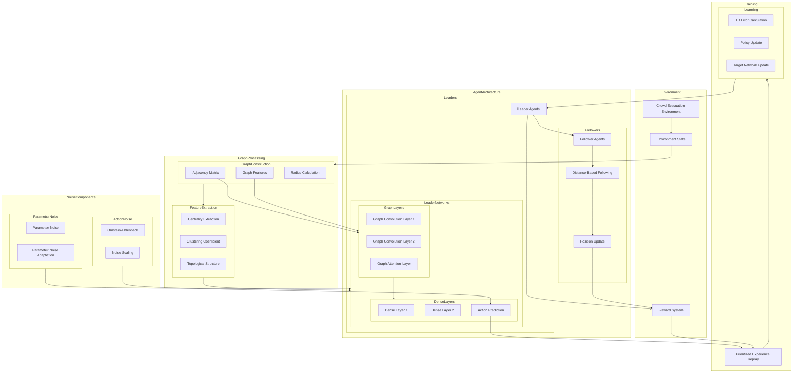

```mermaid
graph TD
    %% Environment Section
    subgraph Environment
        ENV[Crowd Evacuation Environment]
        ENV_STATE[Environment State]
        ENV_REWARD[Reward System]
    end

    %% Agent Architecture Section
    subgraph AgentArchitecture
        subgraph Leaders
            LA[Leader Agents]
            subgraph LeaderNetworks
                subgraph GraphLayers
                    GCN1[Graph Convolution Layer 1]
                    GCN2[Graph Convolution Layer 2]
                    GAT[Graph Attention Layer]
                end
                subgraph DenseLayers
                    FC1[Dense Layer 1]
                    FC2[Dense Layer 2]
                    AP[Action Prediction]
                end
            end
        end

        subgraph Followers
            FA[Follower Agents]
            FD[Distance-Based Following]
            FP[Position Update]
        end
    end

    %% Graph Processing Section
    subgraph GraphProcessing
        subgraph GraphConstruction
            AM[Adjacency Matrix]
            GF[Graph Features]
            RC[Radius Calculation]
        end
        
        subgraph FeatureExtraction
            CE[Centrality Extraction]
            CC[Clustering Coefficient]
            TS[Topological Structure]
        end
    end

    %% Noise Components Section
    subgraph NoiseComponents
        subgraph ActionNoise
            OU[Ornstein-Uhlenbeck]
            NS[Noise Scaling]
        end
        
        subgraph ParameterNoise
            PN[Parameter Noise]
            PNA[Parameter Noise Adaptation]
        end
    end

    %% Training Components Section
    subgraph Training
        PER[Prioritized Experience Replay]
        subgraph Learning
            TD[TD Error Calculation]
            UP[Policy Update]
            TN[Target Network Update]
        end
    end

    %% Connections
    ENV --> ENV_STATE
    ENV_STATE --> GraphConstruction
    
    AM --> GraphLayers
    GF --> GraphLayers
    
    GraphLayers --> DenseLayers
    
    ActionNoise --> AP
    ParameterNoise --> LeaderNetworks
    
    LA --> FA
    FA --> FD --> FP
    
    AP --> PER
    PER --> Learning
    Learning --> LA
    
    LA --> ENV_REWARD
    FP --> ENV_REWARD
    ENV_REWARD --> PER

    GraphConstruction --> FeatureExtraction
    FeatureExtraction --> LeaderNetworks
```