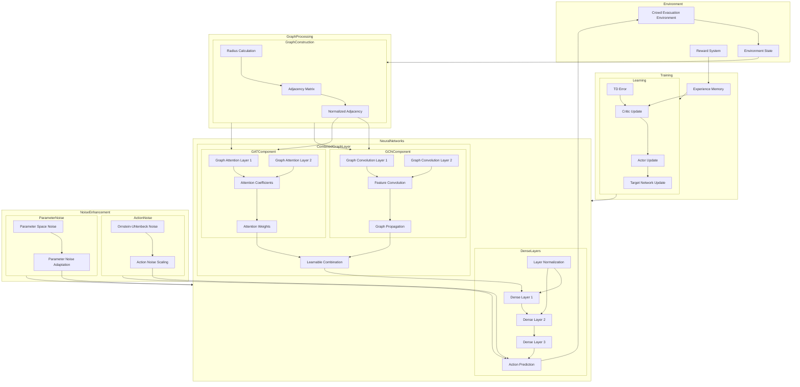

```mermaid
graph TD
    %% Environment Section
    subgraph Environment
        ENV[Crowd Evacuation Environment]
        ENV_STATE[Environment State]
        ENV_REWARD[Reward System]
    end

    %% Neural Network Architecture Section
    subgraph NeuralNetworks
        subgraph CombinedGraphLayer
            subgraph GCNComponent
                GCN1[Graph Convolution Layer 1]
                GCN2[Graph Convolution Layer 2]
                GCONV[Feature Convolution]
                GPROP[Graph Propagation]
            end

            subgraph GATComponent
                GAT1[Graph Attention Layer 1]
                GAT2[Graph Attention Layer 2]
                ATT_C[Attention Coefficients]
                ATT_W[Attention Weights]
            end

            COMB[Learnable Combination]
        end

        subgraph DenseLayers
            FC1[Dense Layer 1]
            FC2[Dense Layer 2]
            FC3[Dense Layer 3]
            LN[Layer Normalization]
            AP[Action Prediction]
        end
    end

    %% Graph Processing Section
    subgraph GraphProcessing
        subgraph GraphConstruction
            AM[Adjacency Matrix]
            NORM_ADJ[Normalized Adjacency]
            RC[Radius Calculation]
        end
    end

    %% Noise Components Section
    subgraph NoiseEnhancement
        subgraph ActionNoise
            OU[Ornstein-Uhlenbeck Noise]
            AN_SCALE[Action Noise Scaling]
        end
        
        subgraph ParameterNoise
            PN[Parameter Space Noise]
            PN_ADAPT[Parameter Noise Adaptation]
        end
    end

    %% Training Components Section
    subgraph Training
        MEM[Experience Memory]
        subgraph Learning
            CRITIC[Critic Update]
            ACTOR[Actor Update]
            TD[TD Error]
            TARGET[Target Network Update]
        end
    end

    %% Connections
    ENV --> ENV_STATE
    ENV_STATE --> GraphConstruction
    
    GraphConstruction --> GCNComponent
    GraphConstruction --> GATComponent
    
    GCN1 --> GCONV
    GCONV --> GPROP
    GCN2 --> GCONV
    
    GAT1 --> ATT_C
    ATT_C --> ATT_W
    GAT2 --> ATT_C
    
    GPROP --> COMB
    ATT_W --> COMB
    
    COMB --> FC1
    FC1 --> FC2
    FC2 --> FC3
    FC3 --> AP
    
    LN --> FC1
    LN --> FC2
    
    ActionNoise --> AP
    ParameterNoise --> NeuralNetworks
    
    AP --> ENV
    ENV_REWARD --> MEM
    MEM --> Learning
    Learning --> NeuralNetworks
    
    %% Detailed Processing
    AM --> NORM_ADJ
    RC --> AM
    NORM_ADJ --> GCNComponent
    NORM_ADJ --> GATComponent
    
    OU --> AN_SCALE
    AN_SCALE --> AP
    PN --> PN_ADAPT
    PN_ADAPT --> NeuralNetworks
    
    %% Learning Flow
    MEM --> CRITIC
    CRITIC --> ACTOR
    TD --> CRITIC
    ACTOR --> TARGET
```