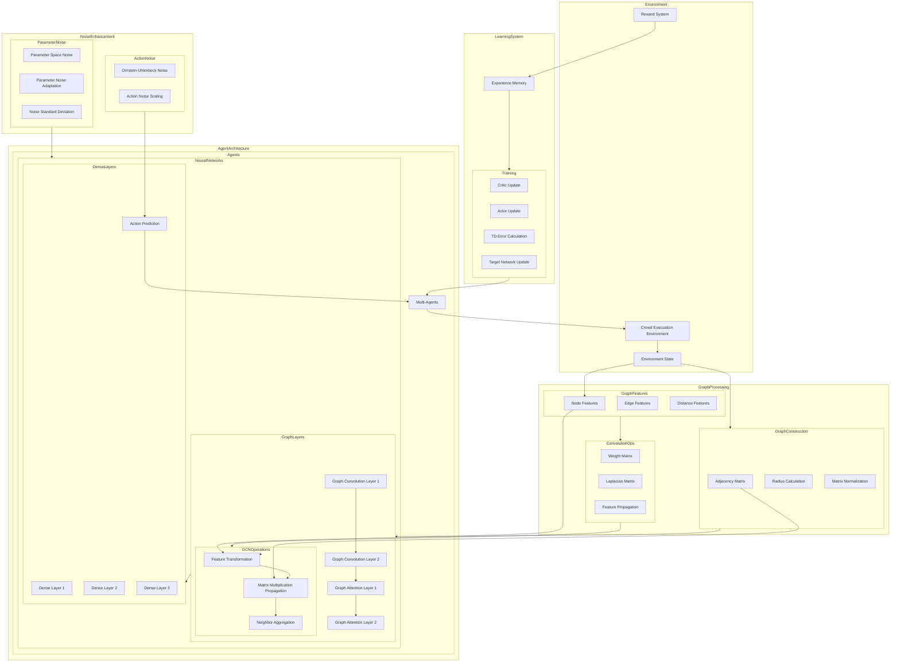

```mermaid
graph TD
    %% Environment Section
    subgraph Environment
        ENV[Crowd Evacuation Environment]
        ENV_STATE[Environment State]
        ENV_REWARD[Reward System]
    end

    %% Agent Architecture Section
    subgraph AgentArchitecture
        subgraph Agents
            MA[Multi-Agents]
            subgraph NeuralNetworks
                subgraph GraphLayers
                    GCN1[Graph Convolution Layer 1]
                    GCN2[Graph Convolution Layer 2]
                    GAT1[Graph Attention Layer 1]
                    GAT2[Graph Attention Layer 2]
                    subgraph GCNOperations
                        FT[Feature Transformation]
                        MMP[Matrix Multiplication Propagation]
                        NA[Neighbor Aggregation]
                    end
                end
                subgraph DenseLayers
                    FC1[Dense Layer 1]
                    FC2[Dense Layer 2]
                    FC3[Dense Layer 3]
                    AP[Action Prediction]
                end
            end
        end
    end

    %% Graph Processing Section
    subgraph GraphProcessing
        subgraph GraphConstruction
            AM[Adjacency Matrix]
            RC[Radius Calculation]
            NORM[Matrix Normalization]
        end
        
        subgraph GraphFeatures
            NF[Node Features]
            EF[Edge Features]
            DF[Distance Features]
        end
        
        subgraph ConvolutionOps
            WM[Weight Matrix]
            LAP[Laplacian Matrix]
            PROP[Feature Propagation]
        end
    end

    %% Noise Enhancement Section
    subgraph NoiseEnhancement
        subgraph ActionNoise
            OU[Ornstein-Uhlenbeck Noise]
            AN_SCALE[Action Noise Scaling]
        end
        
        subgraph ParameterNoise
            PN[Parameter Space Noise]
            PN_ADAPT[Parameter Noise Adaptation]
            PN_STD[Noise Standard Deviation]
        end
    end

    %% Learning Components Section
    subgraph LearningSystem
        MEM[Experience Memory]
        subgraph Training
            CRITIC[Critic Update]
            ACTOR[Actor Update]
            TD[TD Error Calculation]
            TN[Target Network Update]
        end
    end

    %% GCN Specific Connections
    ENV_STATE --> NF
    NF --> FT
    AM --> MMP
    FT --> MMP
    MMP --> NA
    
    %% Layer Connections
    GCN1 --> GCN2
    GCN2 --> GAT1
    GAT1 --> GAT2
    
    %% Graph Processing Connections
    GraphFeatures --> ConvolutionOps
    ConvolutionOps --> GCNOperations
    GCNOperations --> GraphLayers
    
    %% Other Connections
    ENV --> ENV_STATE
    ENV_STATE --> GraphConstruction
    GraphConstruction --> GraphLayers
    GraphLayers --> DenseLayers
    ActionNoise --> AP
    ParameterNoise --> NeuralNetworks
    AP --> MA
    MA --> ENV
    ENV_REWARD --> MEM
    MEM --> Training
    Training --> MA
```