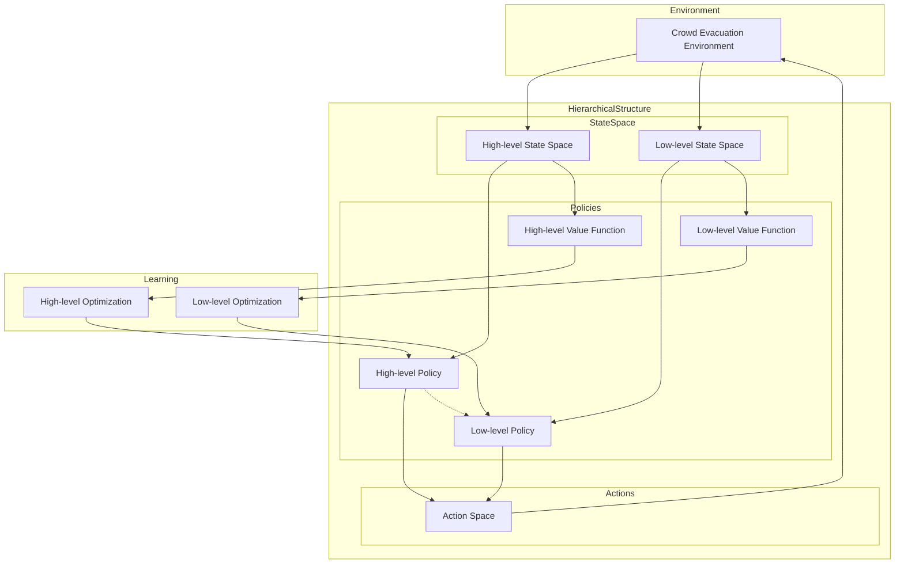

```mermaid
graph TD
    subgraph Environment
        ENV[Crowd Evacuation Environment]
    end

    subgraph HierarchicalStructure
        subgraph StateSpace
            HS[High-level State Space]
            LS[Low-level State Space]
        end
        
        subgraph Actions
            AS[Action Space]
        end
        
        subgraph Policies
            HP[High-level Policy]
            LP[Low-level Policy]
            HV[High-level Value Function]
            LV[Low-level Value Function]
        end
    end

    subgraph Learning
        HO[High-level Optimization]
        LO[Low-level Optimization]
    end

    ENV --> HS
    ENV --> LS
    
    HS --> HP
    HS --> HV
    LS --> LP
    LS --> LV
    
    HP --> AS
    LP --> AS
    AS --> ENV
    
    HV --> HO
    LV --> LO
    
    HO --> HP
    LO --> LP
    
    HP -.-> LP
```