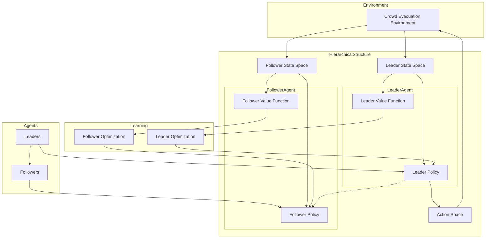

```mermaid
graph TD
    subgraph Environment
        ENV[Crowd Evacuation Environment]
    end

    subgraph Agents
        L[Leaders]
        F[Followers]
    end

    subgraph HierarchicalStructure
        LS[Leader State Space]
        AS[Action Space]
        FS[Follower State Space]
        
        subgraph LeaderAgent
            LP[Leader Policy]
            LV[Leader Value Function]
        end
        
        subgraph FollowerAgent
            FP[Follower Policy]
            FV[Follower Value Function]
        end
    end

    subgraph Learning
        LO[Leader Optimization]
        FO[Follower Optimization]
    end

    ENV --> LS
    ENV --> FS
    L --> LP
    F --> FP
    
    LP --> AS
    AS --> ENV
    
    LS --> LP
    LS --> LV
    FS --> FP
    FS --> FV
    
    LV --> LO
    FV --> FO
    
    LO --> LP
    FO --> FP
    
    LP -.-> FP
    L -.-> F
```