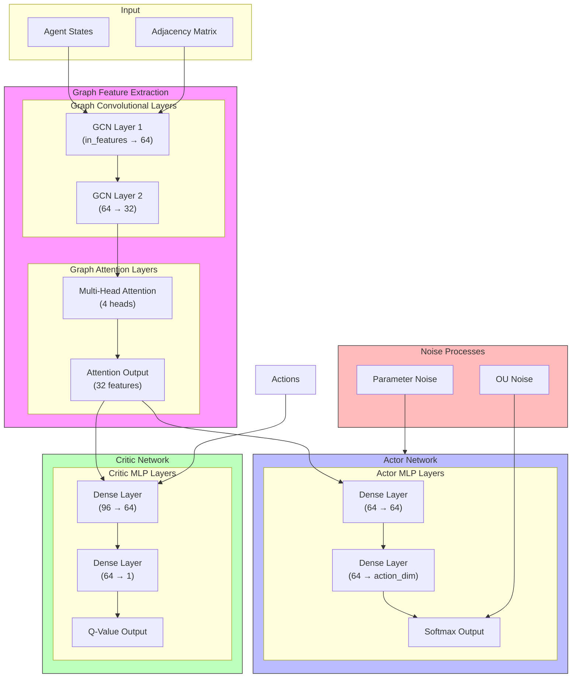

```mermaid
flowchart TB
    subgraph Input
        state[Agent States]
        adj[Adjacency Matrix]
    end

    subgraph GraphFeatures["Graph Feature Extraction"]
        subgraph GCNLayers["Graph Convolutional Layers"]
            gc1["GCN Layer 1\n(in_features → 64)"]
            gc2["GCN Layer 2\n(64 → 32)"]
        end

        subgraph AttentionLayers["Graph Attention Layers"]
            gat["Multi-Head Attention\n(4 heads)"]
            att_out["Attention Output\n(32 features)"]
        end
    end

    subgraph ActorNetwork["Actor Network"]
        subgraph ActorLayers["Actor MLP Layers"]
            a_fc1["Dense Layer\n(64 → 64)"]
            a_fc2["Dense Layer\n(64 → action_dim)"]
            a_out["Softmax Output"]
        end
    end

    subgraph CriticNetwork["Critic Network"]
        subgraph CriticLayers["Critic MLP Layers"]
            c_fc1["Dense Layer\n(96 → 64)"]
            c_fc2["Dense Layer\n(64 → 1)"]
            c_out["Q-Value Output"]
        end
    end


    state --> gc1
    adj --> gc1
    gc1 --> gc2
    gc2 --> gat
    gat --> att_out

    att_out --> a_fc1
    a_fc1 --> a_fc2
    a_fc2 --> a_out

    att_out --> c_fc1
    actions[Actions] --> c_fc1
    c_fc1 --> c_fc2
    c_fc2 --> c_out

    subgraph NoiseProcesses["Noise Processes"]
        direction LR
        ou["OU Noise"]
        param["Parameter Noise"]
    end

    ou --> a_out
    param --> ActorNetwork

    style GraphFeatures fill:#f9f,stroke:#333
    style ActorNetwork fill:#bbf,stroke:#333
    style CriticNetwork fill:#bfb,stroke:#333
    style NoiseProcesses fill:#fbb,stroke:#333
```