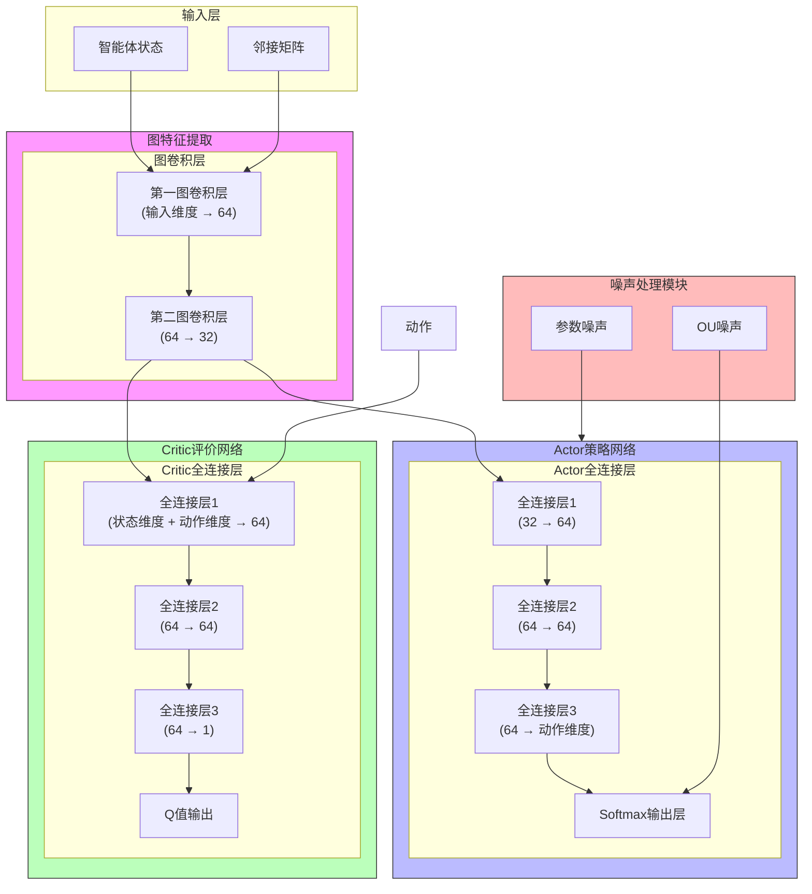

```mermaid
flowchart TB
    subgraph 输入层
        state[智能体状态]
        adj[邻接矩阵]
    end
    subgraph 图特征提取["图特征提取"]
        subgraph GCNLayers["图卷积层"]
            gc1["第一图卷积层\n(输入维度 → 64)"]
            gc2["第二图卷积层\n(64 → 32)"]
        end
    end
    subgraph Actor网络["Actor策略网络"]
        subgraph ActorLayers["Actor全连接层"]
            a_fc1["全连接层1\n(32 → 64)"]
            a_fc2["全连接层2\n(64 → 64)"]
            a_fc3["全连接层3\n(64 → 动作维度)"]
            a_out["Softmax输出层"]
        end
    end
    subgraph Critic网络["Critic评价网络"]
        subgraph CriticLayers["Critic全连接层"]
            c_fc1["全连接层1\n(状态维度 + 动作维度 → 64)"]
            c_fc2["全连接层2\n(64 → 64)"]
            c_fc3["全连接层3\n(64 → 1)"]
            c_out["Q值输出"]
        end
    end
    state --> gc1
    adj --> gc1
    gc1 --> gc2
    gc2 --> a_fc1
    a_fc1 --> a_fc2
    a_fc2 --> a_fc3
    a_fc3 --> a_out
    gc2 --> c_fc1
    actions[动作] --> c_fc1
    c_fc1 --> c_fc2
    c_fc2 --> c_fc3
    c_fc3 --> c_out
    subgraph 噪声处理["噪声处理模块"]
        direction LR
        ou["OU噪声"]
        param["参数噪声"]
    end
    ou --> a_out
    param --> Actor网络
    style 图特征提取 fill:#f9f,stroke:#333
    style Actor网络 fill:#bbf,stroke:#333
    style Critic网络 fill:#bfb,stroke:#333
    style 噪声处理 fill:#fbb,stroke:#333
```