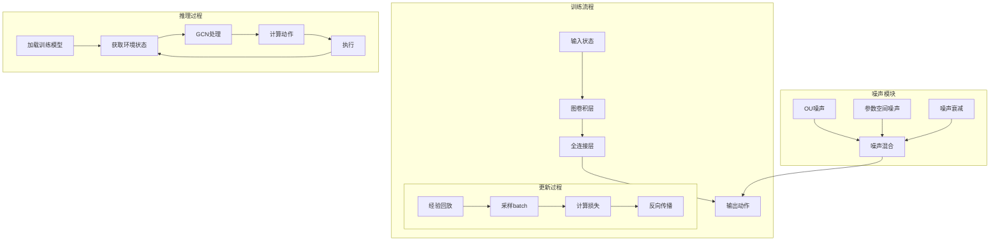

```mermaid
flowchart TB
    subgraph Training["训练流程"]
        Input[输入状态] --> GCN
        GCN[图卷积层] --> FC[全连接层]
        FC --> Out[输出动作]
        
        subgraph Update["更新过程"]
            Memory[经验回放] --> Sample[采样batch]
            Sample --> Loss[计算损失]
            Loss --> Backward[反向传播]
        end
    end

    subgraph NoiseModule["噪声模块"]
        OU[OU噪声]
        Param[参数空间噪声]
        Decay[噪声衰减]
        
        OU & Param --> Mix[噪声混合]
        Decay --> Mix
    end

    Mix --> Out

    subgraph Inference["推理过程"]
        LoadModel[加载训练模型]
        InState[获取环境状态]
        Process[GCN处理]
        Action[计算动作]
        Execute[执行]
        
        LoadModel --> InState
        InState --> Process
        Process --> Action
        Action --> Execute
        Execute --> InState
    end
```