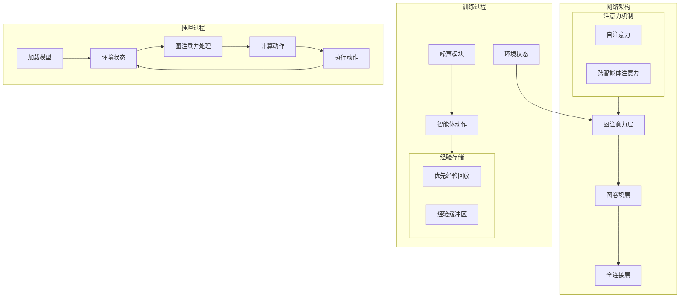

```mermaid
flowchart TB
    subgraph NetworkArch["网络架构"]
        GAT[图注意力层] --> GCN[图卷积层]
        GCN --> FC[全连接层]
        
        subgraph Attention["注意力机制"]
            Self[自注意力]
            Cross[跨智能体注意力]
        end
        
        Attention --> GAT
    end

    subgraph Training["训练过程"]
        State[环境状态] --> GAT
        Noise[噪声模块] --> Action[智能体动作]
        
        subgraph Memory["经验存储"]
            PER[优先经验回放]
            Buffer[经验缓冲区]
        end
        
        Action --> Memory
    end

    subgraph Inference["推理过程"]
        LoadM[加载模型]
        StateI[环境状态]
        Process[图注意力处理]
        ActInf[计算动作]
        Execute[执行动作]
        
        LoadM --> StateI
        StateI --> Process
        Process --> ActInf
        ActInf --> Execute
        Execute --> StateI
    end
```